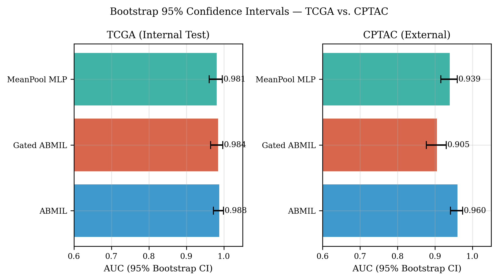

# Whole-Slide Lung Cancer Subtyping with GigaPath

[](https://github.com/monkeyrampage/luad-lusc-gigapath/actions/workflows/quality.yml)

**LUAD vs LUSC classification from whole-slide histopathology using pathology foundation-model embeddings and multiple-instance learning.**

This repository benchmarks handcrafted image features against **GigaPath** representations for distinguishing lung adenocarcinoma (LUAD) from lung squamous cell carcinoma (LUSC). Models are trained on TCGA and evaluated on an external CPTAC cohort without retraining.

### Key results

- **TCGA test AUC:** 0.988 with ABMIL over GigaPath embeddings
- **External CPTAC AUC:** 0.959 without retraining
- **Best classical baseline AUC:** 0.717 with bag-of-visual-words + SVM
- **Patient-level splitting:** no patient appears in more than one split
- **External evaluation:** performance is retained across institution and acquisition-scale differences



The central finding is that the **learned tile representation contributes substantially more to performance than the choice of downstream aggregation model**.

---

## Results

### TCGA test cohort

Evaluation on 161 held-out TCGA slides:

| Model | AUC | Accuracy | F1 |
|---|---:|---:|---:|
| XGBoost (classical) | 0.606 | 0.553 | 0.514 |
| RBF-SVM (classical) | 0.574 | 0.553 | 0.533 |
| MLP (classical) | 0.608 | 0.596 | 0.552 |
| PCA + SVM (classical) | 0.662 | 0.677 | 0.644 |
| BoVW + SVM (classical) | 0.717 | 0.677 | 0.649 |
| ResNet18-cap MIL | 0.976 | 0.913 | 0.913 |
| MeanPool MLP (GigaPath) | 0.981 | 0.938 | 0.933 |
| Gated ABMIL (GigaPath) | 0.985 | 0.944 | 0.943 |
| **ABMIL (GigaPath)** | **0.988** | **0.938** | **0.936** |
| Ensemble (3 GigaPath models) | 0.990 | 0.944 | 0.942 |

### External validation on CPTAC

Zero-shot evaluation on 407 CPTAC slides, using the TCGA-trained models without retraining:

| Model | TCGA AUC | CPTAC AUC | AUC drop | CPTAC accuracy |
|---|---:|---:|---:|---:|
| MeanPool MLP | 0.981 | 0.939 | 0.042 | 0.855 |
| Gated ABMIL | 0.985 | 0.905 | 0.080 | 0.799 |
| **ABMIL** | **0.988** | **0.959** | **0.029** | **0.894** |

TCGA and CPTAC were processed at different effective magnifications (10x and 5x, respectively). The external result therefore reflects a combined shift in institution and image scale and should be interpreted accordingly.

---

## Method overview

The pipeline operates on whole-slide images using tile-level representations followed by slide-level aggregation.

1. **Tiling** — WSIs are divided into 224 × 224 image tiles with background filtering.
2. **Representation** — each tile is encoded either with frozen GigaPath features (1536 dimensions) or handcrafted LBP + GLCM + HOG features (404 dimensions).
3. **Aggregation** — tile representations are combined using mean pooling, attention-based MIL, gated attention MIL, or classical baselines.
4. **Evaluation** — models are assessed with patient-level train/validation/test splits, external CPTAC validation, bootstrap confidence intervals, learning curves, and attention analyses.

### Experimental scale

- **1,025 TCGA slides**
- approximately **4.1 million tiles**
- patient-level train/validation/test separation
- all tiles used at test time
- up to 500 randomly resampled tiles per slide during MIL training
- AdamW optimization with cosine learning-rate scheduling and validation-AUC early stopping

---

## Reproducibility

The repository contains source code, trained checkpoints, split definitions, evaluation outputs, and generated figures. Large image data and embedding files are distributed separately.

### Tier 1 — Reproduce results from cached embeddings

Given the provided HDF5 embeddings, the following analyses can be reproduced without processing raw WSIs:

- model training and evaluation
- TCGA test metrics
- CPTAC inference
- bootstrap confidence intervals
- learning curves
- attention statistics and heatmaps
- counterfactual tile-removal analysis
- publication figures

### Tier 2 — Recreate embeddings from raw WSIs

Raw TCGA/CPTAC slides can be re-downloaded from their original repositories and processed with the included extraction code. This requires GigaPath model weights and suitable GPU resources.

### Tier 3 — Foundation-model pretraining

GigaPath is used as a released pretrained pathology foundation model. Its original pretraining is outside the scope of this repository.

Detailed instructions are available in [`REPRODUCE.md`](REPRODUCE.md).

---

## Quick start

The fastest validation path reproduces the CPTAC inference results using precomputed embeddings. A CPU is sufficient for this step.

```bash
# Clone the repository
git clone https://github.com/monkeyrampage/luad-lusc-gigapath.git project

# Create a minimal CPU environment
conda create -n tcga_eval python=3.10 -y
conda activate tcga_eval
pip install torch --index-url https://download.pytorch.org/whl/cpu
pip install numpy h5py scikit-learn matplotlib

# Point the code to the data root
export LUNG_WSI_DATA=/path/to/base
cd project

# Run external inference
python -m scripts.evaluation.cptac_inference --all-models
```

Expected output:

```text
ABMIL (GigaPath)         TCGA 0.9878   CPTAC 0.9593
Gated ABMIL (GigaPath)   TCGA 0.9848   CPTAC 0.9046
MeanPool MLP (GigaPath)  TCGA 0.9807   CPTAC 0.9391
```

The `TCGA` values printed by this script are checkpoint validation AUCs. Held-out TCGA test AUCs are reported in the results table above.

---

## Data

Large embedding files are hosted separately from the Git repository.

**Precomputed embeddings:** [Google Drive](https://drive.google.com/drive/folders/1Bt8cffqrvFw-DYbN3ijev-PlaqjtucIp?usp=sharing)

Place the downloaded files under `<base>/embeddings/`:

| File | Size | Description |
|---|---:|---|
| `gigapath_embeddings.h5` | 25 GB | TCGA GigaPath tile embeddings (1536-dim) |
| `classical_embeddings.h5` | 6.7 GB | TCGA handcrafted features (404-dim) |
| `cptac_gigapath_v2.h5` | 1.8 GB | CPTAC GigaPath embeddings (5x) |
| `labels.csv` | — | TCGA slide labels |
| `cptac_labels_v2.csv` | — | CPTAC slide labels |

To reproduce only the CPTAC inference numbers, `cptac_gigapath_v2.h5` and `cptac_labels_v2.csv` are sufficient together with the checkpoints already included in the repository.

Raw WSIs are not redistributed. TCGA slides are available from the **NCI Genomic Data Commons** (`TCGA-LUAD`, `TCGA-LUSC`), and CPTAC slides are available through **The Cancer Imaging Archive** (`CPTAC-LUAD`, `CPTAC-LSCC`).

---

## Repository structure

Executable research workflows live under `scripts/` and are grouped by purpose. Run them as Python modules from the repository root, e.g. `python -m scripts.training.train`.

```text
project/
├── data/
│   ├── dataset.py                       # MIL datasets and HDF5 loading
│   └── splits.py                        # patient-level split generation
├── models/
│   └── model.py                         # ABMIL, Gated ABMIL, MeanPool MLP
├── scripts/
│   ├── training/
│   │   ├── train.py                     # GigaPath MIL training
│   │   ├── train_classical.py           # classical feature baselines
│   │   └── train_intermediate.py        # intermediate representation baselines
│   ├── evaluation/
│   │   ├── evaluate.py                  # held-out test evaluation
│   │   ├── eval_checkpoint.py           # checkpoint-based TCGA test recomputation
│   │   ├── cptac_inference.py           # external CPTAC evaluation
│   │   ├── bootstrap_ci.py              # bootstrap confidence intervals
│   │   └── learning_curve.py            # performance vs training-set size
│   ├── analysis/
│   │   ├── attention_stats.py           # attention concentration statistics
│   │   ├── attention_heatmap.py         # spatial attention visualization
│   │   └── counterfactual_tile_removal.py
│   ├── figures/
│   │   ├── make_attention_grid.py
│   │   ├── make_cptac_figures.py
│   │   ├── make_disagreement_attention_grid_v2.py
│   │   ├── make_disagreement_grid_v3.py
│   │   └── make_ieee_figures.py         # publication-style figure generation
│   └── data_prep/
│       └── cptac_download_and_extract.py # CPTAC WSI → GigaPath embeddings
├── splits/                              # exact train/validation/test definitions
├── results/
│   ├── checkpoints/                    # trained model weights
│   ├── logs/                           # metrics and training histories
│   └── figures/                        # generated analysis figures
├── REPRODUCE.md                        # detailed reproducibility guide
├── environment.yml
└── requirements.txt
```

---

## Data paths

All scripts use the `LUNG_WSI_DATA` environment variable as the experiment-data root and fall back to `~/research_data` when it is not set.

Expected layout:

```text
<base>/
├── embeddings/
└── project/
```

Set the path once per shell:

```bash
export LUNG_WSI_DATA=/path/to/base
```

---

## License

Released under the [MIT License](LICENSE). The code may be used, modified, and redistributed, including for commercial purposes, subject to the license terms.
